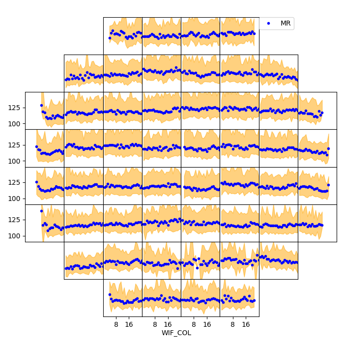

<!--
 DO NOT EDIT.
 THIS FILE WAS AUTOMATICALLY GENERATED BY mkdocs-gallery.
 TO MAKE CHANGES, EDIT THE SOURCE PYTHON FILE:
 "docs/examples/plot_5_wif_trend.py"
 LINE NUMBERS ARE GIVEN BELOW.
-->

!!! note

    Click [here](#download_links)
    to download the full example code or to run this example in your browser via Binder


WIF Trend
=================================
> Wafer Trend Charts by Flash Field For Single Variables

This example demonstrates how to import a local module and how images are
stacked when two plots are created in one code block. The variable ``N`` from
the example 'Local module' (file ``local_module.py``) is imported in the code
below. Further, note that when there is only one code block in an example, the
output appears before the code block.


# mkdocs_gallery_thumbnail_number = 2

# WIF Trend

Flash Field to flash field variation,

The Flash to flash variation is based

API All Input

<!-- GENERATED FROM PYTHON SOURCE LINES 24-30 -->


{: .mkd-glr-single-img srcset="/generated/gallery/images/mkd_glr_plot_5_wif_trend_001.png, /generated/gallery/images/mkd_glr_plot_5_wif_trend_001_2_0x.png 2.0x"}


```{.python }

from wfmap.data import load_data
from wfmap import wif_trend

data = load_data()
fig = wif_trend(data, 'MR')
```


**Total running time of the script:** ( 0 minutes  5.824 seconds)

<div id="download_links"></div>

[](https://mybinder.org/v2/gh/smarie/mkdocs-gallery/gh-pages?urlpath=lab/tree/notebooks/generated/gallery/plot_5_wif_trend.ipynb){ .center}

[:fontawesome-solid-download: Download Python source code: plot_5_wif_trend.py](./plot_5_wif_trend.py){ .md-button .center}

[:fontawesome-solid-download: Download Jupyter notebook: plot_5_wif_trend.ipynb](./plot_5_wif_trend.ipynb){ .md-button .center}


[Gallery generated by mkdocs-gallery](https://mkdocs-gallery.github.io){: .mkd-glr-signature }
