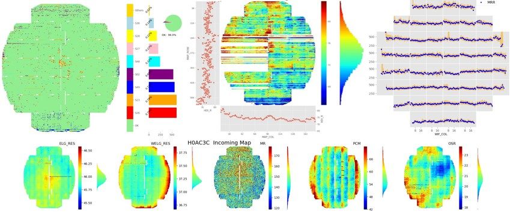

# Welcome to <font color='purple'>wfmap</font> Documentation


## Introduction

`wfmap` helps you understand wafer process data better, by presenting the data with heatmap and trend charts by flash field/shot. You can identify abnormal patterns intuitively in a global perspective and make it easier to compare and find potential correlation between different wafer parameters.



This documentation provides comprehensive introduction from [Data Preparation](https://wfmap.ml/data) to [Various Examples](https://wfmap.ml/generated/gallery). [Example Gallery](https://wfmap.ml/generated/gallery) introduces you to the ability to use the APIs of `wfmap` with the demo data enclosed. You can dive it deeper by reading the [API Reference](https://wfmap.ml/docstrings) or even the [source code](https://github.com/xlhaw/wfmap). A GUI application [WaferViz](https://wfmap.ml/gui) is also built for non-technical users.

Let's roll!

## Installation

It's recommended to install _**wfmap**_ via PyPI using pip:

```bash
pip install wfmap
```

or build the latest build from Github:

```bash
git clone https://github.com/xlhaw/wfmap.git
cd wfmap
python setup.py install
```

A GUI application built with `Gooey` is also shipped together, you can launch it from command line:
```bash
git clone https://github.com/xlhaw/wfmap.git
cd wfmap/gui
pip install -r requirements.txt
python main.py
```
Please read the [WaferViz](https://wfmap.ml/gui) for more details.

## Tutorials

It's a good start to learn the basic usage of this package from [Example Gallery](https://wfmap.ml/generated/gallery), which contains various examples from basic heatmap to highly customized wafer map & trend charts. All examples & images were generated by `mkdocs-gallery`.

<div class="mkd-glr-thumbcontainer" tooltip="WaferMap add additional color distribution plot and trend charts by row/col around basic NumHea...">
    <!--div class="figure align-default" id="id1"-->
        
        <p class="caption">
            <span class="caption-text">
                <a class="reference internal" href="generated\gallery\plot_2_wafermap">
                    <span class="std std-ref">WaferMap `wafermap`</span>
                </a>
            </span>
            <!--a class="headerlink" href="#id1" title="Permalink to this image"></a-->
        </p>
    <!--/div-->
</div>


<div class="mkd-glr-thumbcontainer" tooltip="DefectMap is aimed for defect analysis, beside the defect distribution by cat_heatmap, yield su...">
    <!--div class="figure align-default" id="id1"-->
        
        <p class="caption">
            <span class="caption-text">
                <a class="reference internal" href="generated\gallery\plot_3_defectmap">
                    <span class="std std-ref">DefectMap `defectmap`</span>
                </a>
            </span>
            <!--a class="headerlink" href="#id1" title="Permalink to this image"></a-->
        </p>
    <!--/div-->
</div>

<div class="mkd-glr-thumbcontainer" tooltip="IncomingMap is an horizontal concatenation of multiple WaferMap for wafer incoming data. vsigma...">
    <!--div class="figure align-default" id="id1"-->
        
        <p class="caption">
            <span class="caption-text">
                <a class="reference internal" href="generated\gallery\plot_4_incmap">
                    <span class="std std-ref">IncomingMap</span>
                </a>
            </span>
            <!--a class="headerlink" href="#id1" title="Permalink to this image"></a-->
        </p>
    <!--/div-->
</div>


<div class="mkd-glr-thumbcontainer" tooltip="WIF Trend gives you a clear view of within flash field & field to field tendency and distributi...">
    <!--div class="figure align-default" id="id1"-->
        
        <p class="caption">
            <span class="caption-text">
                <a class="reference internal" href="generated\gallery\plot_5_wif_trend">
                    <span class="std std-ref">WIF Trend `wif_trend`</span>
                </a>
            </span>
            <!--a class="headerlink" href="#id1" title="Permalink to this image"></a-->
        </p>
    <!--/div-->
</div>

<div class="mkd-glr-thumbcontainer" tooltip="Have the advantage of double Y-axis, we&#x27;re able to put two very different variables into same s...">
    <!--div class="figure align-default" id="id1"-->
        
        <p class="caption">
            <span class="caption-text">
                <a class="reference internal" href="generated\gallery\plot_7_twin_trends">
                    <span class="std std-ref">TwinY Trends `twin_trends`</span>
                </a>
            </span>
            <!--a class="headerlink" href="#id1" title="Permalink to this image"></a-->
        </p>
    <!--/div-->
</div>


<div class="mkd-glr-thumbcontainer" tooltip="wif_corrplot is created to further investigate relationship between two variables. Beside the b...">
    <!--div class="figure align-default" id="id1"-->
        
        <p class="caption">
            <span class="caption-text">
                <a class="reference internal" href="generated\gallery\plot_8_wif_corrplot">
                    <span class="std std-ref">WIF Corrrelation Plot `wif_corrplot`</span>
                </a>
            </span>
            <!--a class="headerlink" href="#id1" title="Permalink to this image"></a-->
        </p>
    <!--/div-->
</div>
